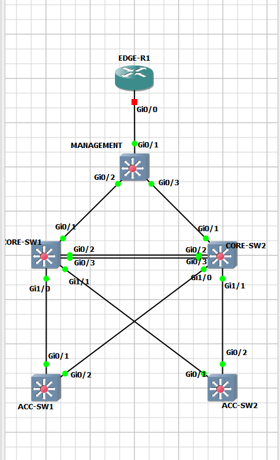

# AIOps Network Configuration Agent - Version 02

A production-ready ReAct agent for network configuration management, built with **LangChain 0.3+ (2026 best practices)**.

## Overview

Version 02 is a complete rewrite focused on:
- **Single ReAct Agent** using LangChain's `create_agent` API
- **RAG-powered** configuration notebook search with FAISS + Gemini reranking
- **Graph-based** network topology queries with Neo4j
- **Safe execution** with parameter validation and dry-run support
- **11 tools** orchestrated across 3 categories: Scholar, Executor, Cypher

## What's New in Version 02

### Architecture Changes
- ✅ Migrated from multi-agent pipeline to **single ReAct agent**
- ✅ Updated to **LangChain 0.3+ API** (`create_agent`)
- ✅ Removed LangGraph dependency (eliminated duplication bugs)
- ✅ Message-based architecture with conversation memory
- ✅ Clean separation: prompts, schemas, agent logic

### RAG Pipeline Improvements
- ✅ Pure LangChain RAG implementation (no LangGraph)
- ✅ FAISS vector store for fast semantic search
- ✅ Gemini embedding + reranking
- ✅ Structured output with Pydantic schemas
- ✅ Configurable retrieval thresholds

### Agent Capabilities
- ✅ Natural language → configuration execution
- ✅ Parameter extraction from queries
- ✅ Missing parameter clarification
- ✅ Multi-step task decomposition
- ✅ Topology-aware decision making
- ✅ Risk assessment and warnings

---

## Quick Start

### 1. Install Dependencies

```bash
pip install langchain langchain-google-genai langchain-community
pip install faiss-cpu google-generativeai neo4j netmiko
pip install python-dotenv pydantic
```

### 2. Set Up Environment

Create `tools/configs/.env`:
```env
GOOGLE_API_KEY=your_gemini_api_key_here
```

### 3. Build Vector Store

```bash
python tools/rebuild_vdb_langchain.py
```

This creates FAISS index from `tools/notebooks.json` (26 configuration notebooks).

### 4. Load Network Topology

```bash
# Fetch live network state
python graph/network_fetch.py

# Load snapshot into Neo4j
python graph/feed_snapshot.py
```

### 5. Run the Agent

```python
from agents import NetworkAgent

# Create agent (no device needed for queries)
agent = NetworkAgent(device=None, verbose=True)

# Query network topology
response = agent.run("Show me all devices in the network")
print(response['output'])

# Search for configurations
response = agent.run("How do I enable SSH?")
print(response['output'])

# Find paths
response = agent.run("What's the shortest path between R1 and R3?")
print(response['output'])
```

---

## Architecture

```
NetworkAgent (Facade)
    ↓
AgentGraph (LangChain 0.3+ StateGraph)
    ↓
11 Tools:
    ├── Scholar Tools (RAG)
    │   ├── scholar_search: FAISS + Gemini reranking
    │   ├── get_notebook_info: Parameter schemas
    │   └── execute_notebook: Safe execution
    │
    ├── Cypher Tools (Neo4j)
    │   ├── list_devices_tool
    │   ├── show_ospf_neighbors_tool
    │   ├── show_interfaces_connected_device_tool
    │   ├── show_cdp_neighbors_device_tool
    │   ├── show_ospf_neighbors_device_tool
    │   ├── show_shortest_path_tool
    │   └── show_all_paths_tool
    │
    └── Device Connection Management
```

---

## Project Structure

```
version02/
├── agents/               # ReAct agent implementation
│   ├── network_agent.py  # Main agent + NetworkAgent class
│   ├── prompts.py        # Prompt templates (FewShotPromptTemplate)
│   ├── schemas.py        # Pydantic models for I/O
│   └── __init__.py       # Exports
│
├── tools/                # Core tooling
│   ├── scholar.py        # RAG search (FAISS + Gemini)
│   ├── executor.py       # Notebook execution
│   ├── base.py           # Device connection (Netmiko)
│   ├── collector.py      # State collection (CDP, OSPF, etc.)
│   ├── notebooks.json    # 26 configuration notebooks
│   ├── rebuild_vdb_langchain.py  # FAISS index builder
│   └── configs/          # Vector store + .env
│
├── graph/                # Network topology
│   ├── cypher.py         # Neo4j query tools
│   ├── base.py           # Neo4j client + device inventory
│   ├── network_fetch.py  # Live state collector
│   ├── feed_snapshot.py  # Neo4j loader
│   └── snapshots/        # Time-stamped network state
│
├── AGENT_USAGE.md        # Detailed usage guide
├── README.md             # This file
└── network.png           # Lab topology diagram
```

---

## Agent Capabilities

### 1. Configuration Search & Execution

**Natural Language → Config**:
```python
agent.run("Set hostname to CORE-SW-01")
# Agent will:
# 1. Search for 'set hostname' notebook
# 2. Extract parameter: hostname='CORE-SW-01'
# 3. Execute cfg_set_hostname notebook
```

**Parameter Clarification**:
```python
agent.run("Create a VLAN")
# Agent will:
# 1. Search for VLAN creation notebook
# 2. Check parameter schema
# 3. Ask: "I need vlan_id (1-4094) and vlan_name. Please provide these."
```

**Multi-Step Tasks**:
```python
agent.run("Enable SSH and create VLAN 10 named Engineering")
# Agent will:
# 1. Execute SSH configuration
# 2. Execute VLAN creation with params
# 3. Report both results
```

### 2. Network Topology Queries

```python
# List all devices
agent.run("Show me all devices")

# Check OSPF neighbors
agent.run("Show all OSPF neighbors")

# Find paths
agent.run("What's the path from CORE-R1 to EDGE-R2?")

# Device connections
agent.run("What's connected to CORE-SW-01?")
```

### 3. Topology-Aware Configuration

```python
agent.run("Show devices connected to CORE-SW-01, then enable SSH on all of them")
# Agent will:
# 1. Use show_interfaces_connected_device_tool
# 2. For each device, execute SSH configuration
```

---

## Tools Reference

### Scholar Tools

#### `scholar_search(query, k=5, top_n=3)`
Search 26 configuration notebooks using RAG.

**Example**:
```python
{
  "query": "enable SSH",
  "results": [
    {
      "id": "cfg_vty_ssh_v2_only",
      "title": "Enable SSH v2 only on VTY lines",
      "risk": "MEDIUM",
      "rerank_score": 9.2
    }
  ]
}
```

#### `get_notebook_info(notebook_id)`
Get parameter schema for a notebook.

**Example**:
```python
{
  "id": "cfg_create_vlan",
  "params_schema": {
    "vlan_id": {"type": "integer", "minimum": 1, "maximum": 4094},
    "vlan_name": {"type": "string"}
  },
  "requires_params": true
}
```

#### `execute_notebook(notebook_id, params, dry_run=False)`
Execute configuration on device.

**Example**:
```python
{
  "success": true,
  "notebook_id": "cfg_set_hostname",
  "commands_sent": ["hostname CORE-SW-01"],
  "dry_run": false,
  "validated": true
}
```

### Cypher Tools

All cypher tools query the Neo4j graph database for network topology:

- `list_devices_tool()`: List all network devices
- `show_ospf_neighbors_tool()`: Show OSPF adjacencies
- `show_interfaces_connected_device_tool(device)`: Device connections
- `show_cdp_neighbors_device_tool(device)`: CDP neighbors
- `show_ospf_neighbors_device_tool(device)`: OSPF neighbors
- `show_shortest_path_tool(device1, device2)`: Path between devices
- `show_all_paths_tool(device1, device2)`: All paths (redundancy check)

---

## Configuration Notebooks

26 curated notebooks in `tools/notebooks.json`:

### Baseline Configuration (5)
- `cfg_set_hostname`: Set device hostname
- `cfg_banner_motd`: Set MOTD banner
- `cfg_banner_login`: Set login banner
- `cfg_set_domain_name`: Configure domain name
- `cfg_loopback_interface`: Create loopback interface

### VLANs & Layer 2 (6)
- `cfg_create_vlan`: Create VLAN
- `cfg_create_svi`: Create SVI (Layer 3)
- `cfg_shutdown_vlan`: Disable VLAN
- `cfg_trunk_interface`: Configure trunk port
- `cfg_access_interface`: Configure access port
- `cfg_etherchannel_layer2`: Configure EtherChannel

### Routing & Layer 3 (8)
- `cfg_ospf_router_id`: Set OSPF router ID
- `cfg_ospf_network`: Add network to OSPF
- `cfg_ospf_interface`: Enable OSPF on interface
- `cfg_ospf_passive_interface`: Set passive interface
- `cfg_ospf_default_route`: Advertise default route
- `cfg_static_route`: Add static route
- `cfg_default_route`: Configure default route
- `cfg_ip_routing`: Enable IP routing

### Security & Management (7)
- `cfg_vty_ssh_v2_only`: Enable SSH v2
- `cfg_vty_transport_none`: Disable VTY access
- `cfg_console_exec_timeout`: Set console timeout
- `cfg_vty_exec_timeout`: Set VTY timeout
- `cfg_enable_secret`: Set enable password
- `cfg_service_password_encryption`: Enable password encryption
- `cfg_logging_synchronous`: Enable logging sync

---

## Example Sessions

### Session 1: Basic Configuration

```python
from agents import NetworkAgent
from tools.base import BaseDeviceCollector

# Connect to device
device = BaseDeviceCollector(
    host="10.0.0.1",
    username="admin",
    password="cisco",
    device_type="cisco_ios"
)

# Create agent
agent = NetworkAgent(device=device, verbose=True)

# Set hostname
response = agent.run("Set hostname to CORE-SW-01")
print(response['output'])
# Output: "Successfully set hostname to CORE-SW-01"

# Enable SSH
response = agent.run("Enable SSH")
print(response['output'])
# Output: "I found 'Enable SSH v2 only on VTY lines'. Would you like me to execute it?"

# Confirm execution
response = agent.run("Yes, execute it")
print(response['output'])
# Output: "SSH v2 enabled successfully on VTY lines"
```

### Session 2: Topology Exploration

```python
agent = NetworkAgent(device=None)  # No device needed for queries

# List devices
response = agent.run("Show me all devices")
print(response['output'])
# Output: "Here are all devices: R1 (router, 10.0.0.1), SW1 (switch, 10.0.0.2), ..."

# Check OSPF
response = agent.run("Show OSPF neighbors")
print(response['output'])
# Output: "OSPF neighbors: R1 <-> R2 (FULL/DR), R2 <-> R3 (FULL/DROTHER), ..."

# Find path
response = agent.run("What's the path from R1 to R3?")
print(response['output'])
# Output: "Shortest path: R1 -> GigabitEthernet0/0 -> R2 -> GigabitEthernet0/1 -> R3"
```

### Session 3: Multi-Step Configuration

```python
agent = NetworkAgent(device=device, verbose=True)

# Complex task
response = agent.run("Create VLAN 10 named Engineering, then create SVI with IP 10.10.10.1/24")
print(response['output'])
# Output: "Completed: 1) Created VLAN 10 'Engineering', 2) Created SVI with IP 10.10.10.1 255.255.255.0"

# Verify
response = agent.run("Show VLANs on this device")
print(response['output'])
# Output: "VLAN 10 (Engineering) is configured and up"
```

---

## Best Practices

### 1. Start with Queries
Always test with read-only queries before executing configurations:
```python
agent = NetworkAgent(device=None)  # No device = read-only
agent.run("How do I enable SSH?")  # Search only
```

### 2. Use Dry Run
Test configurations before applying:
```python
agent.run("Set hostname to TEST-DEVICE, use dry_run=True")
```

### 3. Clear Memory Between Contexts
```python
agent.clear_memory()  # Start fresh conversation
```

### 4. Check Logs
Enable verbose mode for debugging:
```python
agent = NetworkAgent(verbose=True)
```

### 5. Handle Errors Gracefully
```python
result = agent.run(query)
if "error" in result:
    print(f"Error: {result['error']}")
else:
    print(f"Success: {result['output']}")
```

---

## Advanced Usage

### Custom Checkpointer for Memory

```python
from langgraph.checkpoint.memory import MemorySaver

checkpointer = MemorySaver()
agent = NetworkAgent(device=device, checkpointer=checkpointer)

# Conversations are persisted across sessions
response1 = agent.run("Show device R1", thread_id="session1")
response2 = agent.run("What's its IP?", thread_id="session1")  # Agent remembers R1
```

### Different Models

```python
# Fast + cheap (default)
agent = NetworkAgent(model_name="gemini-2.5-flash")

# More powerful (if available)
agent = NetworkAgent(model_name="gemini-2.0-pro")
```

### Async Execution

```python
response = await agent.run_async("Show all devices")
```

---

## Troubleshooting

### FAISS Index Not Found
```bash
python tools/rebuild_vdb_langchain.py
```

### Neo4j Connection Error
Check Neo4j is running and credentials in `graph/base.py` are correct.

### No Device Connection Error
Make sure to set device before executing configurations:
```python
agent.set_device(device)
```

### Import Errors
Ensure all dependencies are installed:
```bash
pip install -r requirements.txt  # Create this if needed
```

---

## Testing

### Test Agent Creation
```python
from agents import NetworkAgent

agent = NetworkAgent(device=None, verbose=False)
print(f"Agent created with {len(agent.get_tools())} tools")
```

### Test Scholar Search
```python
from tools.scholar import scholar_search

results = scholar_search("enable SSH", k=5, top_n=3)
print(f"Found {len(results)} notebooks")
```

### Test Cypher Queries
```python
from graph.cypher import list_devices

devices = list_devices()
print(f"Found {len(devices)} devices in graph")
```

---

## Lab Topology

The PoC uses a small lab network connected via CDP and OSPF:



**Devices**:
- EDGE-R1: Edge router (10.10.10.1)
- CORE-SW1: Core switch (10.10.10.2)
- CORE-SW2: Core switch (10.10.10.3)
- ACC-SW1: Access switch (10.10.10.4)
- ACC-SW2: Access switch (10.10.10.5)
- MANAGEMENT: Management switch (10.10.10.10)

---

## Technology Stack

- **LangChain 0.3+**: Agent framework with `create_agent` API
- **Google Gemini 2.5 Flash**: LLM (fast, cost-effective)
- **FAISS**: Vector store for notebook search
- **Neo4j**: Graph database for network topology
- **Netmiko**: Multi-vendor device access
- **Pydantic**: Schema validation
- **Python 3.10+**: Core runtime

---

## Differences from Version 01

| Aspect | Version 01 | Version 02 |
|--------|-----------|-----------|
| **Architecture** | Multi-agent pipeline (cypher → planner → scholar) | Single ReAct agent |
| **LangChain API** | Custom multi-agent | `create_agent` (0.3+) |
| **LangGraph** | Used for orchestration | Removed (caused bugs) |
| **RAG Pipeline** | LangGraph + CrossEncoder | Pure LangChain + Gemini |
| **Prompts** | Manual construction | FewShotPromptTemplate |
| **Memory** | Custom implementation | Built-in StateGraph memory |
| **Tools** | 8 tools (split across agents) | 11 tools (single agent) |
| **Output Format** | Step-by-step JSON | Message-based responses |

---

## Future Enhancements

### Short Term
- [ ] Add rollback support for failed configurations
- [ ] Implement approval workflow for high-risk changes
- [ ] Add configuration validation after execution
- [ ] Support for configuration templates

### Medium Term
- [ ] Multi-device orchestration (configure N devices)
- [ ] Anomaly detection integration
- [ ] Configuration drift detection
- [ ] Backup/restore workflows

### Long Term
- [ ] Support for Juniper, Arista, Palo Alto
- [ ] BGP and advanced routing protocols
- [ ] Automated remediation workflows
- [ ] Integration with monitoring systems

---

## Contributing

This is a PoC project. For production use:
1. Add comprehensive testing
2. Implement proper authentication
3. Add audit logging
4. Set up CI/CD pipelines
5. Add rate limiting and error handling

---

## License

MIT License - See LICENSE file for details

---

## Documentation

- [AGENT_USAGE.md](AGENT_USAGE.md): Detailed agent usage guide
- [tools/notebooks.json](tools/notebooks.json): All configuration notebooks
- [graph/README.md](graph/README.md): Graph pipeline documentation (if exists)

---

## Support

For issues or questions:
1. Check [AGENT_USAGE.md](AGENT_USAGE.md) for examples
2. Review agent logs with `verbose=True`
3. Test components individually (scholar, cypher, executor)

---

## Acknowledgments

Built with:
- [LangChain](https://python.langchain.com/) - Agent framework
- [Google Gemini](https://ai.google.dev/) - LLM provider
- [Neo4j](https://neo4j.com/) - Graph database
- [Netmiko](https://github.com/ktbyers/netmiko) - Network device access

---

**Version**: 02
**Status**: Production-ready PoC
**Last Updated**: 2026-01-09
